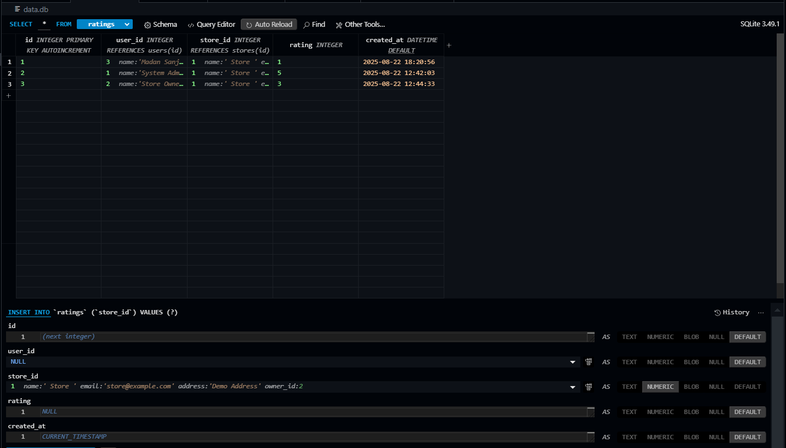
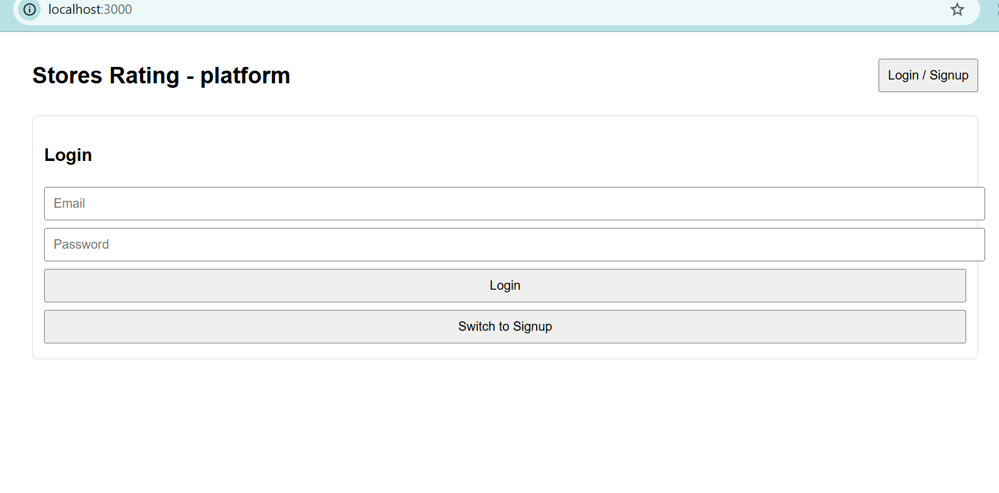
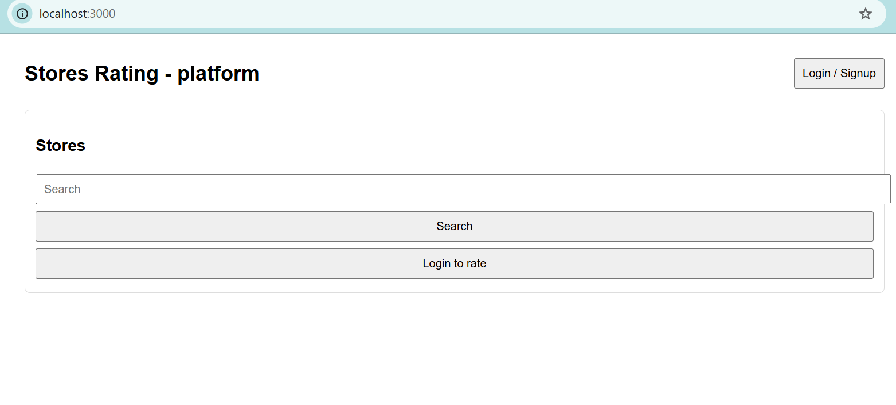

# FullStack -stores platform 
======================

This bundle provides a compact demo implementation for the FullStack Intern Coding Challenge.

What it includes
- Express backend (server.js) using SQLite (data.db) for persistence.
- Single-file React frontend (public/index.html) using CDN builds of React.
- Seeded users:
  - admin@gmail.com / Admin@123!  (System Administrator)
  - madan@gmail.com / Owner@123!  (Store Owner)

  One Example 
  - ghalmemadan62@gmail.com
  - password - Madan@4545 

# How to run

1. Run:
   npm install
   node server.js
2. Open http://localhost:3000

# Project Synopsis: Store Rating Web Application

# 1. Introduction
This project outlines the development of a full-stack web application designed to facilitate user ratings for registered stores. The application will feature a single, role-based login system, providing different functionalities to System Administrators, Normal Users, and Store Owners. The core functionality revolves around a 1-5 star rating system for stores.

# 2. Objectives
The primary objectives of this project are:

To create a secure, role-based authentication and authorization system.

To enable Normal Users to sign up, view stores, submit and modify ratings.

To provide Store Owners with a dashboard to view submitted ratings and their store's average rating.

To equip System Administrators with comprehensive administrative tools for managing users, stores, and application data.

To implement robust form validation and data sorting features.

# #3. User Roles & Functionalities
System Administrator
This role has the highest level of access and is responsible for overall system management.

User and Store Management: Can add new users (Normal, Admin) and stores.

Dashboard: A central view to monitor key metrics such as the total number of users, stores, and ratings.

Data Oversight: Can view, filter, and sort lists of users and stores, with the ability to see a store owner's rating.

Normal User
This is the core user base of the application.

Authentication: Can sign up and log in.

Store Interaction: Can view a list of all stores, search by name and address, and see store details including ratings.

Rating System: Can submit and modify a rating (1-5) for any store.

Account Management: Can update their own password.

Store Owner
This role has specific, limited access to manage their own store's data.

Authentication: Can log in and update their password.

Dashboard: Can view a list of users who have rated their store and see the average rating of their store.

# 4. Technical Requirements
Frontend: The application will be built using ReactJS to create a dynamic and responsive user interface.

Backend: A robust backend will be developed using one of the specified frameworks: ExpressJs, Loopback, or NestJs.

Database: A relational database system, either PostgreSQL or MySQL, will be used to store all user, store, and rating data, with a schema designed following best practices.

# Database Table

# Project Output interface

 
 # Than Apply After CSS in  Stores Rating Platform

  Improvements applied:

- Clean, modern card layout with hover animation

- Consistent button styles with primary color

- Better input and focus styles

- Store cards look neat with icons (⭐ for rating, 📍 for address)

- Responsive layout remains intact

# Apply CSS Output 

